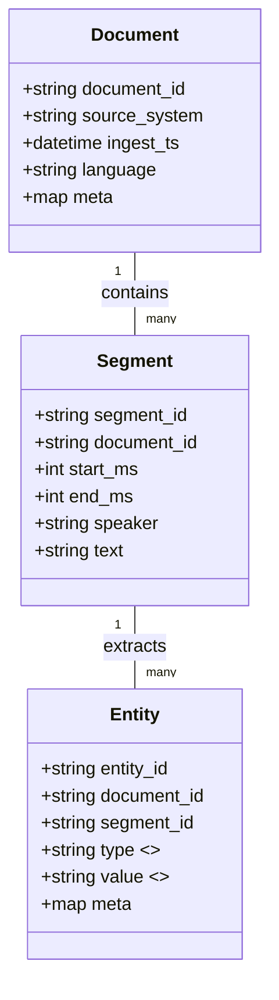

# Architecture (v1)

**High-level flow (Phase 0 baseline):**

```mermaid
flowchart LR
  subgraph Ingest
    A[Raw S3 Bucket (nimbus-raw-<env>-eu-west-2)]
  end

  B[Macie (PII/PHI classification)]
  C[Glue ETL + Crawlers]
  D[(Iceberg Tables in S3)]
  E[Lake Formation (LF-tags, RBAC, row/col-level)]
  F[Athena (SQL over Iceberg)]
  G[CloudTrail / GuardDuty / Security Hub / Config]
  H[EventBridge]
  I[Lambda / DynamoDB (metadata/services)]
  J[Dashboards & Alerts]

  A --> B
  A --> C
  C --> D
  D --> E --> F
  A --> G
  B --> G
  F --> J
  G --> J
  H --> I --> J
```

> Regional baseline: `eu-west-1`. Data is synthetic-only in all environments (`dev`, `prod`).

## Data Model (v1 — curated layer)



## Governance & Controls (Phase 0 intent)

- **LF-tags:** `Sensitivity` (High/Medium/Low) applied to tables/columns; used for row/column filters.
- **Published Views:** guarantee no **High** columns; **High** is masked/tokenised or excluded by design.
- **Default Resource Tags:** `Project=nimbus-vault`, `Environment=<env>` (and later `Sensitivity` where applicable).
- **Iceberg Tables:** curated/published in S3 with schema evolution; Athena for query; Lake Formation for authz.

## Buckets (naming recap)

- `nimbus-raw-<env>-eu-west-1`
- `nimbus-curated-<env>-eu-west-1`
- `nimbus-published-<env>-eu-west-1`
- `nimbus-logs-<env>-eu-west-1`
- `nimbus-athena-<env>-eu-west-1`
- `nimbus-tmp-<env>-eu-west-1`

Core services: S3, KMS, IAM, Lake Formation, Glue, Athena (Iceberg), Macie, CloudTrail, GuardDuty, Security Hub, Config, EventBridge, Lambda, DynamoDB.